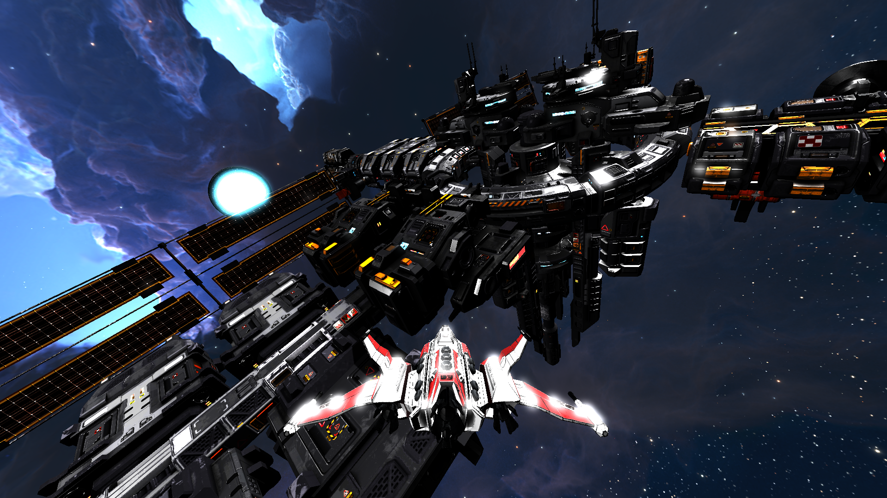
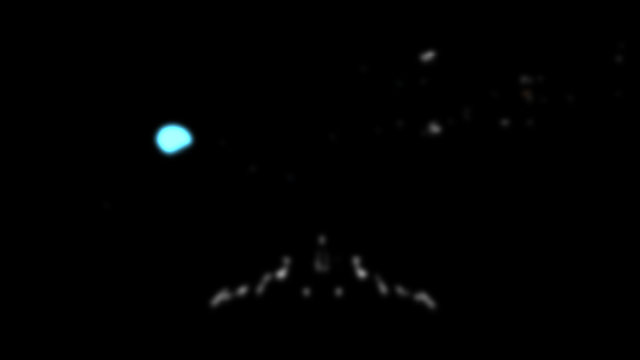

# 목차

**1. Deferred Rendering**

**2. Instancing**

**3. Irradiance Mapping (SkyLight)**

**4. Tone Mapping**

**5. Bloom Effect**

**6. Shadow Mapping**

# Deferred Rendering
## 사진
</img> 
</img>
</img>
</img>
</img>
</img>
###### 
<순서대로 AlbedoBuffer, EmissiveBuffer, RoughnessMetallicBuffer, WorldNormalBuffer, WorldPositionBuffer>

</img> 
###### 
<최종 렌더링 이미지>

## 세부 설명
빛에 영향을 받는 오브젝트들을 우선적으로 Depth Test를 통과시키고 최종적으로 화면을 꽉채우는 사각형에 화면상에 나타나는 픽셀들에 대해서만 라이팅 계산을하여 퍼포먼스 향상.

# Instancing
## 사진

</img>
###### 
<인스턴싱을 하는 메쉬>

</img>
###### 
<인스턴싱을 하는 메쉬의 DrawCall>

</img>
###### 
<인스턴싱을 하는 메쉬의 InputLayout Data>

## 세부 설명
기존의 ConstantBuffer로 GPU에 보내는 Data를 InputLayout으로 옮겨서 하나의 DrawCall로 처리. DrawCall을 줄임으로써 퍼포먼스 향상.

# Irradiance Mapping (SkyLight)
## 사진

</img>
###### 
< No Skylight >

</img>
###### 
< Skylight >

</img>
###### 
< Skylight Convolute 코드 >

## 세부 설명
Scene의 Skybox의 색상이 오브젝트에 영향을 끼치게 하여 좀더 Scene과 어울리는 색상을 표현. 구면좌표계에 있는 Skybox의 좌표를 이산적인 양을 증가 시키면서 Convolute하고 후에 메쉬의 표면 노말을 입력을 텍스쳐 좌표로 이용하여 샘플링하여 빛을 계산.

# Tone Mapping
## 개요

</img>
###### 
< Tone Mapping 이전 >

</img>
###### 
< Tone Mapping 적용 >

## 세부 설명
HDR 밝기 영역으로 표현된 Scene을 모니터가 표현할 수 있는 영역으로 압축하여 표현. 기존의 Scene을 Floating-Point-Buffer에 렌더링한 후 최종 렌더링된 Scene을 Reinhard Tone Mapping 기법을 사용하여 압축.

# Bloom Effect
## 사진

</img>
###### 
< Without Bloom >

</img>
###### 
< With Bloom >

</img>
###### 
< Bright Color Blurred >

## 세부 설명
실제 카메라 렌즈에 빛번짐 효과를 구현. Floating-Point-Buffer에 렌더링된 Scene에서 일정 밝기 이상의 부분을 추출하여 텍스쳐에 저장. 이 텍스쳐를 Compute Shader를 사용하여 여러번 가우시안 블러링한 후 기존에 Scene과 Additive Blending을 함.

# Shadow Mapping
## 사진

</img>
###### 
< Shadow Map >

## 세부 설명
Directional Light로부터 생기는 Shadow를 구현. Directional Light의 방향을 바라보는 플레이어를 따라다니는 카메라를 만들고, Scene을 렌더링(Depth만). 렌더링된 Shadow Map을 이후에 라이팅을 계산할 때, 월드공간의 좌표를 Shadow Map의 공간으로 변환 후 샘플링 하여 사용. PCF(Percentage Closer Filtering)기법을 사용하여 그림자의 외곽부분을 자연스럽게 표현.

